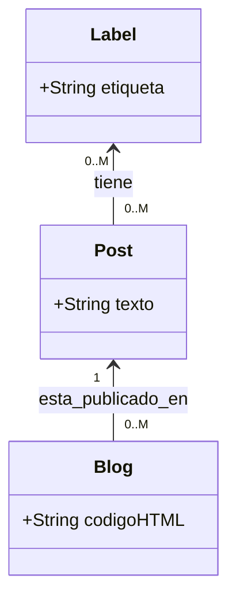

## POO How To
POO How To (Programación orientada a objetos how to) te indica cómo podemos establecer las primcipales relaciones que ya conocemos de Bases de Datos en programación orientada a objetos con C#

!!! info "Títol"
    Es muy inportante tener claros los conceptos de POO en C#

### Entidades y relaciones

